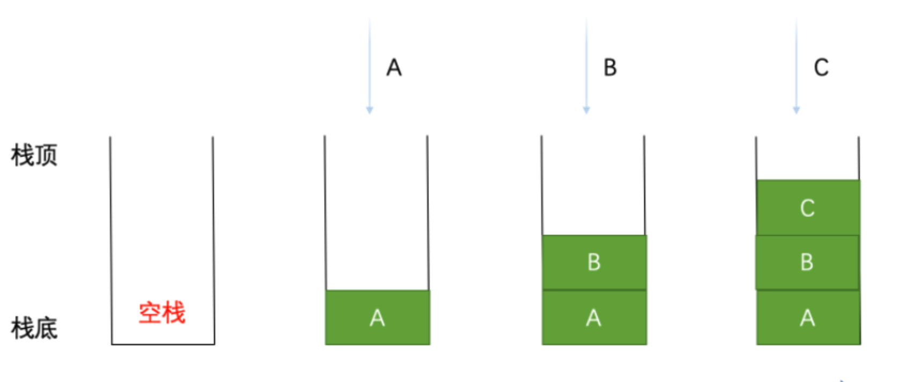
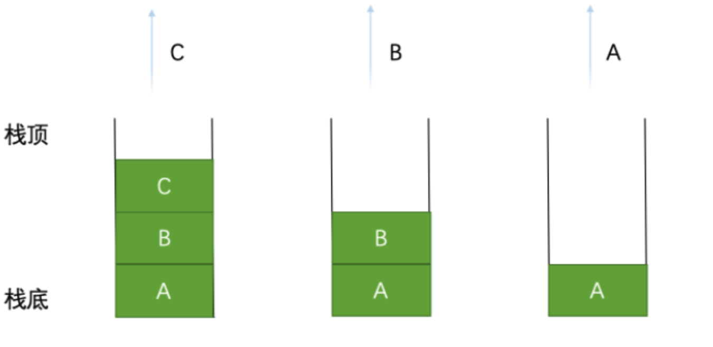
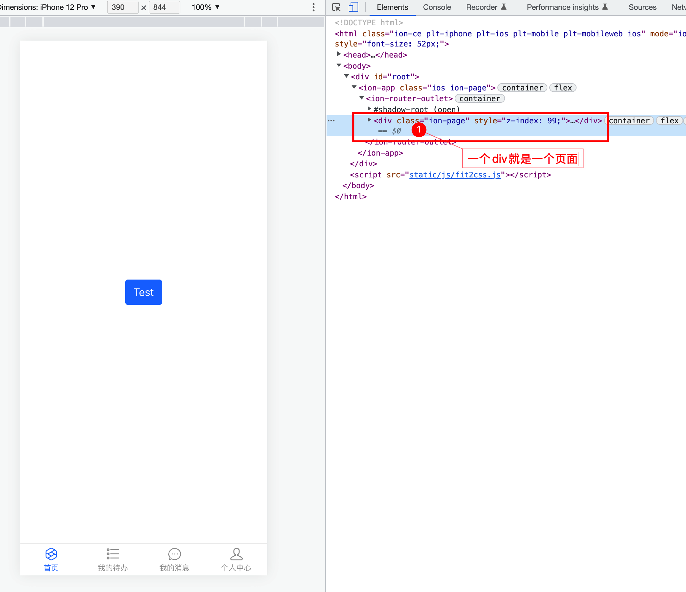

<center>移动端h5项目，模拟移动端栈路由</center>

## 效果


## 栈路由
栈路由什么意思尼，其实app就是一个栈，栈遵循先进后出的原则，打开页面即入栈操作，关闭页面即出栈操作。


  - 打开A页面的时候，就是A入栈，A页面在栈顶，app就显示A页面
  - 又打开了B页面，B又入栈，B页面在栈顶，A页面在栈中并没有销毁，app显示B页面
  - 再打开C页面，C又入栈， C页面在栈顶，AB页面在栈中并没有销毁， app显示C页面

<br/>

  - C页面关闭(出栈), B页面成为栈顶， app显示B页面
  - B页面关闭(出栈), A页面成为栈顶，app显示A页面

## 实现
这里用的第三方的 @ionic/react-router 路由
```
import React, { useEffect } from 'react'
import { IonApp, IonRouterOutlet, setupIonicReact } from '@ionic/react'
import { IonReactHashRouter } from '@ionic/react-router'
import { Route, Redirect } from 'react-router-dom'
import loadable from '@loadable/component'

const MainTabs = loadable(() => import('@pages/main' /* webpackChunkName: 'MainTabs', webpackPrefetch: true */))
const ImgList = loadable(() => import('@pages/imgList' /* webpackChunkName: 'ImgList', webpackPrefetch: true */))
const ImgDetail = loadable(() => import('@pages/imgDetail' /* webpackChunkName: 'ImgDetail', webpackPrefetch: true */))

const App = () => {
  useEffect(() => {
    setupIonicReact({
      mode: 'ios'
    })
  }, [])

  return (
    <IonApp>
      <IonReactHashRouter>
        <IonRouterOutlet>
          <Route exact={true} path="/" render={() => <Redirect to="/main" />} />
          <Route path={'/main'} exact component={MainTabs} />
          <Route path={'/imgList'} exact component={ImgList} />
          <Route path={'/imgDetail'} exact component={ImgDetail} />
        </IonRouterOutlet>
      </IonReactHashRouter>
    </IonApp>
  )
}

export default App

```
## 分析如何实现
<br/>

<br/>

<br/>


